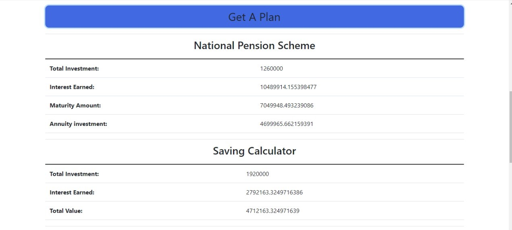
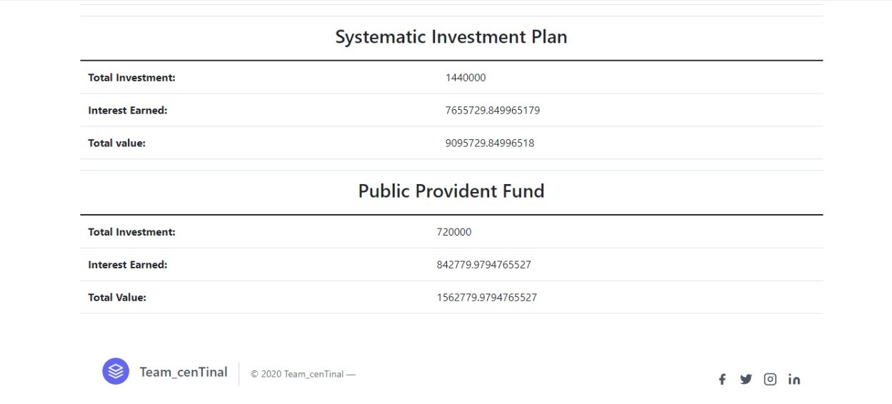

# InvestorBuddy

**Version 1.0.0**

A platform that gives you a peek into the future revealing how your investments will perform so that you can manage you 
wealth and plans accordingly.

Warren Buffett once said:

>“*If you don’t find a way to make money while you sleep*,
>*you will work until you die*.”

---

## TABLE OF CONTENTS

1. [Description](#description)
2. [Contributors](#contributors)
3. [How to use](#how-to-use)

---

## DESCRIPTION

It is a website where you will be able to estimate your future returns from various schemes such as:

1. **NPS(National Pension Scheme)**
2. **SIP(Systematic Investment Plan)**
3. **PPFs(Public Provident Funds)**
4. **Saving Options**

*There is also a basic and safer investment plan available based on your salary to provide you maximum returns*.

---

---

## CONTRIBUTORS

1. Praveen Kumar Yadav praveenyadav340@gmail.com
2. Prashant Kumar Bhaiya 20dec002@nith.ac.in

---

## HOW TO USE

STEP1: ADD REQUIRED FIELDS.

STEP2: CHOOSE A SCHEME.

STEP3: GET YOUR PLAN.

